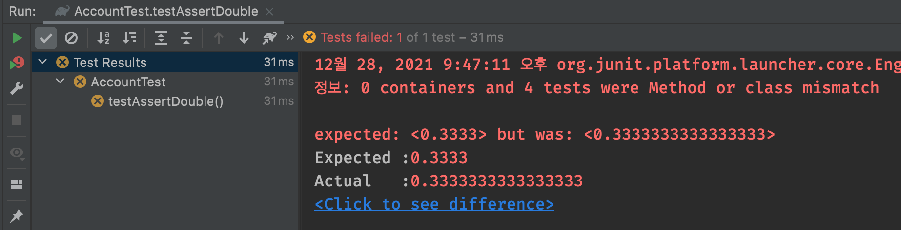
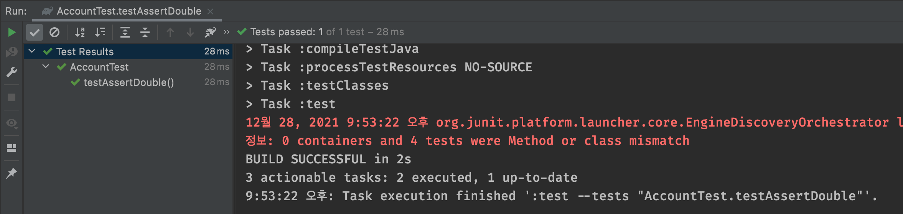
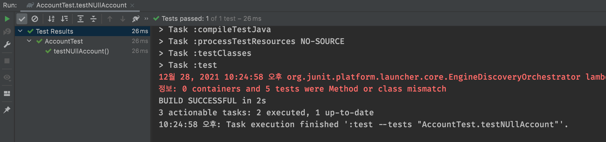

# github link - [TDD_practice](https://github.com/KwonCheulJin/TDD_practice)

# Chapter 2 - JUnit과 Hamcrest

## - 체크리스트

- <input type="checkbox" checked/> **테스트 픽스처의 개념**
- <input type="checkbox" checked/> **JUnit 3**
  - 단정문
  - 테스트 스위트
- <input type="checkbox"/> **JUnit 4**
  - @Test
  - @BeforeClass, @AfterClass, @Before, @After
  - 예외처리 테스트
  - 시간 제한 테스트
  - @Runwith
  - @SuiteClasses
  - [**고급 기능 소개**]
    - 파라미터화된 테스트
    - Rule
    - Theory
- <input type="checkbox"/> **Hamcrest**

### 단정문

### `assertEquals([message], expected, actual)`

#### [어제 내용에 이어서 진행]

- assertEquals 시리즈 중 모양이 다소 다른 것이 있는데 바로 `assertEquals(double expected, double actual, double delta, [message])`메소드다.
- 메소드 인자 마지막에 delta라는 항목이 하나 더 있다.
- 소수점을 갖는 float나 double 데이터형의 경우에는 정확하게 일치하는 값을 찾기 어려울 수 있다. 그럴 경우 delta라는 오차 보정 값을 이용해 적절한 오차 범위 내의 값은 동일한 값으로 판단할 수 있게 해준다.

```java
@Test
void testAssertDouble() {
    assertEquals(0.3333, 1/3d, 0.00001);
}
```



```java
@Test
void testAssertDouble() {
    assertEquals(0.3333, 1/3d, 0.0001);
}
```



- 예상값와 같은 소수자리를 맞춰주어야 테스트에 성공을 한다.
- 책에서는 float타입끼리의 비교는 제공하지 않는다라고 되어있는데 현재 JUnit API 문서에는 float도 비교가 가능한 것으로 되어있다.(2010년도에 나왔던 당시에는 불가 했던 것 같다.)
- 참고로 float는 4바이트 저장영역에 2<sup>23</sup>의 정밀도를 갖고, double은 8바이트 저장소의 2<sup>52</sup>의 정밀도 영역을 갖는다.

### `assertSame(expected, actual, [message])`

### `assertNotSame(expected, actual, [message])`

- assertSame은 두 객체가 정말 동일한 객체의 주소값으로 비교하는 단정문이다.
- 객체를 비교할 때 equals 메소드를 사용하지 않고 바로 등가비교(==)를 한다.
- assertNotSame도 마찬가지로 두 객체를 주소로 비교한다. 다만 이 경우 주소값이 다르면 무조건 true가 된다.
- assertSame은 주로 동일 객체임을 증명하는데 쓰인다.

#### 싱글톤(Singleton) : 디자인 패턴에서 나온 개념으로, 특정 클래스의 인스턴스가 오직 하나만 생성될 수 있게 만들어주는 패턴이다. 이때 static으로 지정된 getInstance() 같은 메소드를 통해서만 객체에 접근 가능하게 만든다. 따라서 몇 번을 호출해도 동일한 객체가 지속적으로 반환되거나 이용된다. 일반적으로 객체 생성과 소멸에 비용이 많이 드는 객체를 싱글톤으로 만들어놓아 효율을 높인다.

```java
[책 예제]
static public void assertSame(String message, Object expected, Object actual) {
  if(expected == actual) return;
  failNotSame(message, expected, actual);
}

```

```java
[JUnit 5 AssertSame.class]
static void assertSame(Object expected, Object actual, String message) {
  if (expected != actual) {
    failNotSame(expected, actual, message);
  }
}
static void assertSame(Object expected, Object actual, Supplier<String> messageSupplier) {
  if (expected != actual) {
    failNotSame(expected, actual, nullSafeGet(messageSupplier));
  }
}
```

### `assertTrue(expected, [message])`

### `assertFalse(expected, [message])`

- 예상값의 참 / 거짓을 판별하는 단정문이다.
- boolean 타입 메소드를 이용할 경우나, 부등호 비교, 범위 비교등을 판단할 때 사용한다.
- 가끔 assertTrue(account.getBalance()==0)같은 식으로 등가비교를 하는 경우가 있는데, 이때 단정문이 실패할 경우 account.getBalance()의 값을 바로 알 수 없어 불편하다. 등호 비교는 가급적 assertEquals(0, account.getBalance())형식을 사용하도록 권장한다.

```java
[JUnit 5 AssertTrue.class]
static void assertTrue(boolean condition, String message) {
  if (!condition) {
    fail(buildPrefix(message) + EXPECTED_TRUE, true, false);
  }
}
```

### `assertNull(actual, [message])`

### `assertNotNull(actual, [message])`

- 대상 값의 null 여부를 판단하는 단정문이다.

```java
@Test
void testNUllAccount() {
    account = null;
    assertNull(account);
}
```



```java
static void assertNull(Object actual, String message) {
  if (actual != null) {
    failNotNull(actual, message);
  }
}
```

- assert 시리즈는 예상값이 assert 문장 다음에 이어지는 글자와 상태가 일치한다는 걸 확인하는 문장이다.
- assert를 '~이어야 함!'으로 해석하면 헷갈리지 않을 수 있다. 그럴

### `fail([message])`

- 이 메소드가 호출되면 해당 테스트 케이스는 그 즉식 실패한다.
- 현재 작성 중인 메소드의 경우 단정문을 쓰지 않았으면 예외가 발생하지 않는 이상 무조건 성공하는 테스트 케이스가 된다.
- 만일 아직 테스트 케이스를 작성 중인데 완료하지 못한 채 구현을 중단해야 하는 경우라면 끝 부분에 fail()을 추가해놓으면 도움이 된다.
- 예외처리를 테스트 하기 위한 트릭으로 fail()을 사용하기도 한다.

```java
public void testWithdraw_현재잔고이하_인출요구시() throws Exception {
  Account account = new Account(10000);
  account.withdraw(20000); //OverWithdrawRequestException이 발생해야함!
}
```

- 위와 같은 경우처럼 특정 조건에서 예외가 발생해야 정산인 경우를 테스트 케이스로 작성하려면 아래와 같이 하면 된다.

```java
public void testWithdraw_현재잔고이하_인출요구시() throws Exception {
  Account account = new Account(10000);
  try {
    account.withdraw(20000); //1
    fail(); //2
  } catch (OverWithdrawRequestException e) {
    assertTrue(true); //3
  }
}
```

1. OverWithdrawRequestException이 발생해야 함!
2. 만일 위에서 예외가 발생하지 않아서 이 부분까지 실행되면 실패함.
3. 빈 줄로 남겨둬도 무방하다 명시적으로 표시함.

### 테스트 러너(Test Runner)

```text
- junit.swingui.TestRunner.run(테스트클래스.class);
- junit.textui.TestRunner.run(테스트클래스.class);
- junit.awtui.TestRunner.run(테스트클래스.class);
```

- JUnit 프레임워크는 명령행 프롬프트에서 실행하거나 셸 스크립트 등을 이용해 실행할 수도 있다.
- 이를 위해 JUnit은 테스트 러너라는 테스트 실행 클래스를 제공한다.
- 위의 기능은 Junit3에서만 제공한다.
- 추가 내용은 생략하겠다.xml에

### 테스트 스위트(Test Suite)

```text
- 여러 개의 테스트 케이스를 한꺼번에 수행하고자 할 때
- 테스트 스위트는 테스트 케이스와 다른 테스트 스위트를 포함시킬 수 있다.
- 메소드는 반드시 public static Test suite()여야 한다.
- 테스트 추가는 suite.addTestSuite(테스트클래스.class) 형식을 갖는다.
```

- 아래의 사이트에서 JUnit 5 TestSuite 예제를 확인 할 수 있다.

Reference : [JUnit 5 TestSuite Example](https://howtodoinjava.com/junit5/junit5-test-suites-examples/)

- 테스트 스위트는 여러 개의 테스트 케이스를 함께 수행할 때 사용한다.

```toc

```
